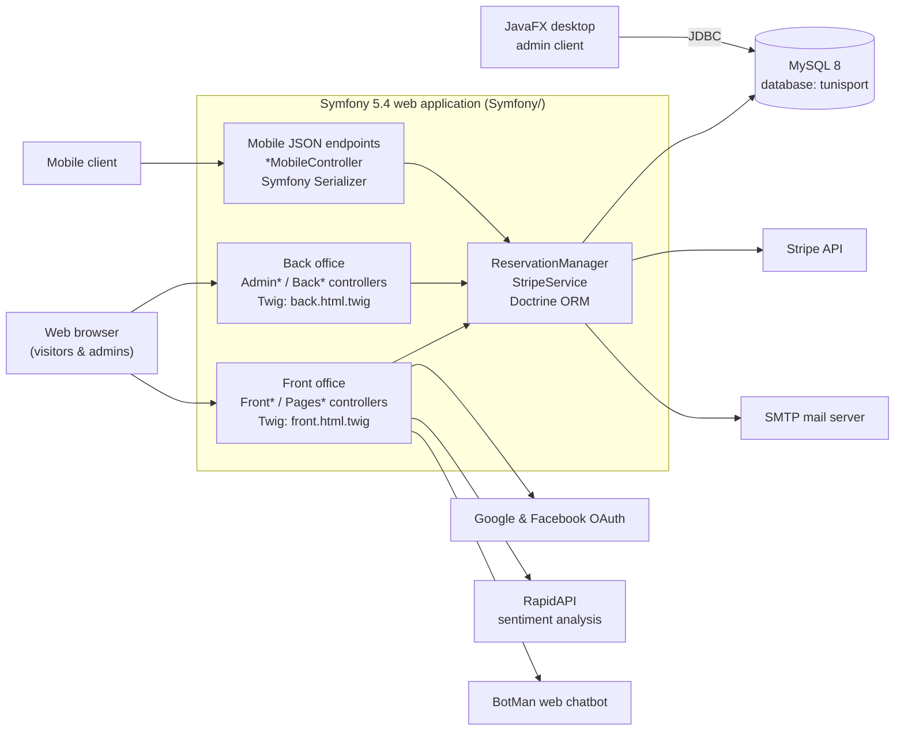

# Tunisport

Tunisport is a football match reservation platform for Tunisian sporting events. It lets visitors browse matches, teams, tournaments and venues, book and pay for tickets online, arrange associated accommodation and transport, and interact through a blog, comments, complaints and a chatbot. Administrators manage the catalogue and reservations through a back office, and a separate JavaFX desktop client offers a native admin view of the match schedule.

The repository holds **two independent applications that share a single MySQL database named `tunisport`**. They have unrelated toolchains and no code in common — the only contract between them is the database schema.

---

## ⚠️ Current status — read this first

**The Symfony application does not boot.** This repository is a work-in-progress snapshot, not a running deployment.

The eight files that previously carried unresolved `git stash` conflict markers have been resolved (toward the feature-complete side), so all configuration now parses. But the configuration and controllers still reference **24 PHP classes that do not exist in `src/`**, and `config/bundles.php` enables two bundles that are not declared in `composer.json`. Booting will fail until those are supplied or their references removed.

The full inventory, with the exact file and line of every dangling reference, is in **[docs/AUDIT.md](docs/AUDIT.md)**. Read it before trying to run the app.

The JavaFX client is also not buildable as-is: `Java/nbproject/project.properties` points at a JAR on a specific machine (`C:\Users\ASUS\Downloads\...`). See [Troubleshooting](#troubleshooting).

---

## Architecture



### Components and responsibilities

| Component | Path | Responsibility |
| --- | --- | --- |
| Symfony web app | `Symfony/` | Public front office, admin back office, and JSON endpoints for the mobile client. Owns the Doctrine schema. |
| JavaFX desktop client | `Java/` | Native admin view over match data. Talks to the same MySQL database directly over JDBC — it does **not** call the Symfony app. |
| MySQL database | external | The only integration point between the two applications. |

### How the two applications stay in sync

There is **no shared schema definition and no automated check**. The Java client hardcodes table and column names that must match Doctrine's naming for the corresponding entities — for example `match_f (id, equipe_a_id, equipe_b_id, date_match, type_match_id, stade_id, tournoi_id, resultat_a, resultat_b, prix, image, image2)` maps to `App\Entity\MatchF`. A Doctrine migration that renames a column will silently break the desktop client. Keep `Java/src/Services/MatchFCRUD.java` and `Java/src/Entités/` aligned with `Symfony/src/Entity/` by hand.

### Front office / back office / mobile split

Adding an endpoint for the mobile client means adding a new `*mobile` controller action returning a `JsonResponse` — the project does not use content negotiation.

- `Front*`, `Pages*` controllers → public Twig pages extending `templates/front.html.twig`
- `Admin*`, `Back*` controllers → back office under `templates/admin/`, extending `templates/back.html.twig`
- `BlogMobileController`, `HebergementmobileController` → `JsonResponse` built with the Symfony Serializer

---

## Technology stack

Verified from `composer.json`, `config/`, and the source — not from prior documentation.

**Symfony web application**

| Area | Technology |
| --- | --- |
| Language | PHP `>= 7.2.5` (code uses PHP 8 attributes, so PHP 8.0+ is required in practice) |
| Framework | Symfony `5.4.*` |
| ORM / database | Doctrine ORM `^2.14`, Doctrine Migrations, MySQL 8 |
| Templating | Twig `^2.12 \|\| ^3.0` |
| Payments | `stripe/stripe-php ^10.8`, wrapped by `App\Service\StripeService` |
| Authentication | Symfony Security (custom authenticators), `knpuniversity/oauth2-client-bundle` with `league/oauth2-google` and `league/oauth2-facebook` |
| Two-factor auth | `scheb/2fa-bundle`, `scheb/2fa-totp` |
| Pagination | `knplabs/knp-paginator-bundle` |
| PDF export | `tecnickcom/tcpdf` (`PdfController`) |
| Chatbot | `botman/botman` + `botman/driver-web` |
| Mail | Symfony Mailer over SMTP |
| Flash messages | `mercuryseries/flashy-bundle` |
| Testing | PHPUnit `^9.5` via `symfony/phpunit-bridge` |

**JavaFX desktop client**

| Area | Technology |
| --- | --- |
| Language | Java, source/target level 1.8 |
| UI | JavaFX with FXML views, FontAwesomeFX 8.5 |
| Build | Apache Ant (NetBeans-generated `nbproject/build-impl.xml`) |
| Database access | Raw JDBC via MySQL Connector/J — no ORM |

**Not used, despite appearances**

- **No asset build step.** There is no npm, Webpack or Symfony Encore pipeline and no `package.json` at the Symfony root. Front-end assets are committed under `public/assets`, `public/assetsFront`, `public/assetsLogin` and a Bower-style `Symfony/components/` (jQuery, Moment, FullCalendar, RequireJS). The `Symfony/node_modules/` directory is a leftover with no manifest that can restore it; it is git-ignored.
- **No Docker deployment.** `Symfony/docker-compose.yml` is the untouched Symfony Flex skeleton and provisions **PostgreSQL**, which contradicts the MySQL `DATABASE_URL` the application actually uses. Ignore it.
- **No CI/CD.** There are no GitHub Actions, GitLab CI, Jenkins or deployment scripts anywhere in the repository.

---

## Project structure

```text
Tunisport/
├── README.md                   # this file
├── CLAUDE.md                   # guidance for AI coding agents
├── .gitignore                  # repository-wide ignore rules
├── docs/
│   └── AUDIT.md                # full repository audit: known gaps, ambiguities, findings
│
├── Symfony/                    # Symfony 5.4 web application
│   ├── .env                    # local config WITH REAL CREDENTIALS — git-ignored, do not commit
│   ├── .env.example            # placeholder template — copy to .env.local
│   ├── .env.test               # test-environment defaults
│   ├── composer.json           # PHP dependencies
│   ├── phpunit.xml.dist        # PHPUnit configuration
│   ├── docker-compose.yml      # UNUSED Flex Postgres skeleton — does not match the app
│   ├── bin/                    # console, phpunit
│   ├── config/
│   │   ├── bundles.php         # enabled bundles
│   │   ├── routes.yaml         # fully commented out — routing is annotation/attribute only
│   │   └── packages/           # framework, doctrine, security, messenger, scheb_2fa, …
│   ├── migrations/             # 5 Doctrine migrations, all March 2023 — behind the entities
│   ├── src/
│   │   ├── Controller/         # 26 controllers: front office, back office, mobile JSON
│   │   ├── Entity/             # 20 Doctrine entities + Traits/StripeTrait.php
│   │   ├── Repository/         # 15 Doctrine repositories
│   │   ├── Form/               # 17 Symfony form types
│   │   ├── Manager/            # ReservationManager — reservation business logic
│   │   ├── Service/            # StripeService — payment integration
│   │   ├── Security/           # LoginAuthenticator
│   │   └── Kernel.php
│   ├── templates/              # Twig: base/front/back layouts + 27 feature directories
│   ├── public/                 # web root: index.php, committed assets, uploads/
│   ├── components/             # committed Bower-style JS libraries
│   ├── translations/
│   └── tests/                  # bootstrap.php only — no test cases
│
└── Java/                       # NetBeans/Ant JavaFX desktop admin client
    ├── build.xml               # put custom targets in the -pre-*/-post-* hooks here
    ├── manifest.mf
    ├── nbproject/              # NetBeans project metadata (build-impl.xml is generated)
    └── src/
        ├── tunisport/          # Tunisport.java — main class
        ├── Entités/            # POJOs: MatchF, Equipe
        ├── Interfaces/         # InterfaceMatch<T> CRUD contract
        ├── Services/           # MatchFCRUD — JDBC implementation
        ├── Controlleurs/       # JavaFX controllers for the FXML views
        ├── Views/              # .fxml layouts and .css stylesheets
        ├── Utils/              # DataBase — JDBC connection singleton
        └── Images/             # icons
```

---

## Prerequisites

**For the Symfony application**

- PHP 8.0 or newer with the `ctype` and `iconv` extensions (`composer.json` declares `>= 7.2.5`, but the entities use PHP 8 attributes)
- [Composer](https://getcomposer.org/)
- MySQL 8 running on `127.0.0.1:3306`
- Optionally the [Symfony CLI](https://symfony.com/download) for `symfony server:start`

**For the JavaFX desktop client**

- JDK 8 (the project targets source/target 1.8 and uses the bundled JavaFX)
- Apache Ant, or NetBeans 8.x
- MySQL Connector/J on the classpath (registered in NetBeans as the `MySQLDriver` library)
- `fontawesomefx-8.5.jar` — see [Troubleshooting](#troubleshooting)

---

## Installation

```bash
git clone https://github.com/KHSIB-Hamdi/Tunisport.git
cd Tunisport
```

### Symfony application

`vendor/` is not committed, so dependencies must be installed:

```bash
cd Symfony
composer install
```

> The committed `composer.lock` was produced by resolving a stash conflict and its integrity is not guaranteed. If `composer install` reports a lock file out of sync with `composer.json`, regenerate it with `composer update`.

Create the database and apply the schema:

```bash
php bin/console doctrine:database:create
php bin/console doctrine:migrations:migrate
```

> The five migrations stop at March 2023 and are **behind** the 20 current entities. Run `php bin/console doctrine:schema:validate` to see the drift; you will likely need `php bin/console doctrine:schema:update --dump-sql` to reach a working schema. Do not assume the migrations alone produce the correct database.

### JavaFX desktop client

Open `Java/` in NetBeans, or build from the command line:

```bash
cd Java
ant clean jar
```

Both fail on a fresh machine until the FontAwesomeFX JAR path is fixed — see [Troubleshooting](#troubleshooting).

---

## Configuration

Copy the template and fill in your own values. `.env.local` overrides `.env` and is git-ignored:

```bash
cd Symfony
cp .env.example .env.local
```

| Variable | Required | Purpose |
| --- | --- | --- |
| `APP_ENV` | yes | `dev`, `test` or `prod`. **Also selects which Stripe keys are used** — see the note below. |
| `APP_SECRET` | yes | Symfony secret; also the `remember_me` signing secret. |
| `DATABASE_URL` | yes | Doctrine MySQL DSN. The database must be named `tunisport` to stay compatible with the Java client. |
| `MESSENGER_TRANSPORT_DSN` | yes | Referenced by `config/packages/messenger.yaml`; the app will not boot without it. |
| `VAR_DUMPER_SERVER` | yes in `dev` | Referenced by `config/packages/debug.yaml`. **Missing from the committed `.env`.** |
| `GOOGLE_CLIENT_ID` / `GOOGLE_CLIENT_SECRET` | for Google login | Google Cloud OAuth 2.0 client credentials. |
| `OAUTH_FACEBOOK_ID` / `OAUTH_FACEBOOK_SECRET` | for Facebook login | Facebook app credentials. |
| `MAILER_DSN` | for outgoing mail | Symfony Mailer SMTP DSN. |
| `STRIPE_PUBLIC_KEY_TEST` / `STRIPE_SECRET_KEY_TEST` | for payments in dev | Stripe test-mode keys. |
| `STRIPE_PUBLIC_KEY_LIVE` / `STRIPE_SECRET_KEY_LIVE` | for payments outside dev | Stripe live keys. Currently **empty**. |

> **Stripe key selection is environment-driven.** `App\Service\StripeService` uses the `*_TEST` keys when `APP_ENV === 'dev'` and the `*_LIVE` keys otherwise. Because the live keys are blank, running with `APP_ENV=prod` will fail at the first payment.

> **The Giphy API key used by `ChatBotController` is hardcoded in the source**, not read from the environment. It is not configurable without a code change.

The JavaFX client has **no configuration file**. Its connection settings are hardcoded in `Java/src/Utils/DataBase.java` (URL, user, password). Edit that file to point at a different database.

---

## Running locally

**Symfony application** — from `Symfony/`:

```bash
symfony server:start
# or, without the Symfony CLI:
php -S 127.0.0.1:8000 -t public
```

Then open <http://127.0.0.1:8000>.

Useful console commands:

```bash
php bin/console cache:clear
php bin/console debug:router            # routes come from annotations/attributes only
php bin/console doctrine:schema:validate
php bin/console make:migration
```

**JavaFX desktop client** — from `Java/`:

```bash
ant run          # main class: tunisport.Tunisport
```

MySQL must be running and the `tunisport` database must exist for either application to do anything useful.

---

## Testing

**Symfony**

```bash
php bin/phpunit                             # whole suite
php bin/phpunit tests/Path/To/SomeTest.php  # one file
php bin/phpunit --filter testMethodName     # one test
```

PHPUnit 9.5 is configured through `phpunit.xml.dist` and the Symfony bridge, **but `Symfony/tests/` contains only `bootstrap.php` — there are zero test cases.** The suite runs and passes vacuously. There are no integration, end-to-end, lint, formatting or static-analysis tools configured in this project.

**Java**

`ant test` exists as a NetBeans-generated target, but there are **no JUnit tests**. `Java/src/Tests/FirstWindow.java` is a standalone JavaFX application despite its location, not a test case.

---

## Build

```bash
# Symfony — no compilation step; warm the production cache instead
cd Symfony
composer install --no-dev --optimize-autoloader
APP_ENV=prod php bin/console cache:clear

# Java — produces Java/dist/tunisport.jar
cd Java
ant clean jar
```

Front-end assets require no build: they are committed under `Symfony/public/`.

---

## Deployment

**No deployment configuration exists in this repository.** There is no Dockerfile, no CI/CD pipeline, no infrastructure-as-code, no web-server configuration and no deployment script. `Symfony/docker-compose.yml` is the unmodified Symfony Flex skeleton — it provisions PostgreSQL and does not match this application.

Deploying would require decisions that have not been made yet; nothing here should be taken as an established process.

## Environment separation

Only two environments actually exist:

| Environment | Configured by | Notes |
| --- | --- | --- |
| **Development** | `.env` (with `APP_ENV=dev`), overridden by your `.env.local` | The only environment that has been used. Stripe test keys, debug toolbar and profiler enabled. |
| **Test** | `.env.test` | Used by PHPUnit. Sets a dummy `APP_SECRET` and a `_test` database suffix. No test cases exist to run against it. |

There is **no staging and no production environment**. `APP_ENV=prod` is supported by Symfony itself but is not configured here — the live Stripe keys are blank and no production secrets mechanism is set up.

---

## Troubleshooting

**`composer install` fails with a lock file / platform error**
The committed `composer.lock` came out of a stash conflict resolution. Run `composer update` to regenerate it. Note that `composer.json` declares `php >= 7.2.5` while the entities use PHP 8 attributes; if Composer resolves to PHP 7-era packages, install on PHP 8 and re-run.

**The application throws "class not found" on boot**
Expected. Configuration and controllers reference 24 classes that are absent from `src/` — including `App\Security\GoogleAuthenticator`, `App\Security\FacebookAuthenticator` and `App\Security\UserChecker` (all three named in `config/packages/security.yaml`), `App\Form\UserType`, `App\Service\Mailer`, eight Doctrine repositories and the whole `App\ChatBot\Conversation` namespace. `config/bundles.php` also enables `VichUploaderBundle` and `DoctrineFixturesBundle`, neither of which is required in `composer.json`. See [docs/AUDIT.md](docs/AUDIT.md) for the complete list with file and line references.

**Security config error: undefined user provider `app_user_provider`**
`config/packages/security.yaml` sets `provider: app_user_provider` on the `main` firewall but only defines `users_in_memory` under `providers`. Defining the entity provider requires choosing which `User` property is the login identifier, which is genuinely ambiguous in this codebase — see the ambiguities section of [docs/AUDIT.md](docs/AUDIT.md).

**Doctrine connects to PostgreSQL, or `docker-compose up` gives you the wrong database**
Ignore `Symfony/docker-compose.yml`. The application uses MySQL via `DATABASE_URL`.

**Schema does not match the entities**
The migrations stop at March 2023 and are incomplete. Trust `php bin/console doctrine:schema:validate` over the migration history.

**The Java project will not compile: cannot find `fontawesomefx-8.5.jar`**
`Java/nbproject/project.properties` references an absolute path on another developer's machine (`C:\Users\ASUS\Downloads\...`). Download FontAwesomeFX 8.5, then update `file.reference.fontawesomefx-8.5.jar` to your own path, or re-add the library through the NetBeans project properties dialog. The `MySQLDriver` classpath entry is likewise a NetBeans global library that must exist on your installation.

**The Java client shows a `NullPointerException` on every query**
`Utils.DataBase` catches the connection `SQLException`, prints it and leaves the connection `null`. Check the console for the original connection error — usually MySQL is not running, or the `tunisport` database does not exist.

**`node_modules/` and `Java/build/` appear as untracked but should not be committed**
They are covered by `.gitignore`. They remain on disk deliberately; `node_modules/` in particular cannot be restored by `npm install` because there is no `package.json`.

---

## Contributing

Configure your Git identity before committing:

```bash
git config user.name  "KHSIB-Hamdi"
git config user.email "hamdikhsib12@gmail.com"
```

Before opening a change, please:

- Check the file you are editing against [docs/AUDIT.md](docs/AUDIT.md) — several known gaps are documented rather than fixed.
- Keep the Java entity/table names in sync with the Doctrine entities when changing the schema.
- Never commit `.env`, credentials, `vendor/`, `node_modules/` or build output.
- Prefer `PreparedStatement` in new Java database code; the existing `MatchFCRUD` builds SQL by string concatenation and is injection-prone.
- Put new payment and reservation logic in `App\Manager\ReservationManager` and `App\Service\StripeService` rather than inline in controllers.
